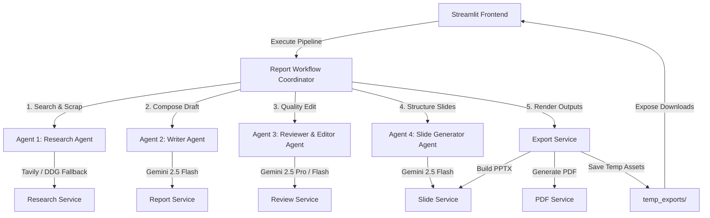

# Automated Report Generator

Automated Report Generator is a production-grade, multi-agent AI system built in Python using Streamlit, Google Gemini API (`google-genai` SDK), Tavily Search API, python-pptx, and ReportLab. It automatically researches a topic, drafts a detailed report, reviews/scores it for quality, and outputs a formatted slide deck presentation and PDF.

## System Architecture



---

## Features

- **Multi-Agent Execution Pipeline**:
  - **Research Agent**: Collects factual content via Tavily API or pure-Python DuckDuckGo HTML scraping. Deduplicates urls and applies deterministic domain credibility scoring.
  - **Writer Agent**: Converts facts into a structured report based on audience and tone. Supports context-only mode when research is disabled.
  - **Reviewer and Editor Agent**: Reviews drafts for consistency, weak claims, grammar, and outputs an improved report and quality score out of 100.
  - **Slide Generator Agent**: Summarizes the report into slides and provides detailed speaker notes.
- **Robust Exports**:
  - Download reports in Markdown, TXT, and PDF.
  - Download presentation slides in PPTX and speaker notes in Markdown.
  - Download review feedback in structured JSON.
- **Production-Grade Resilience**:
  - Strict input/output validation using Pydantic.
  - Exponential backoff retry logic for Gemini API.
  - Custom HTML scraper for DDG to bypass Rust compiler issues.
  - Self-cleaning temporary export directories.
  - API Health Check function.
- **Sanitized UI Logs**: Displays safe status events in the UI without exposing sensitive URL metadata or API keys.

---

## Tech Stack

- **Core**: Python 3.12+
- **Frontend**: Streamlit
- **LLM SDK**: `google-genai` (Gemini 2.5 Flash / Pro)
- **Web Tools**: Tavily Search API, Custom HTML Scraping (`httpx`)
- **Document Generators**: python-pptx, ReportLab
- **Testing & Quality**: pytest, pytest-cov, Ruff

---

## Setup Instructions

### Prerequisites
- Python 3.12 or 3.13 installed
- Git
- Gemini API Key ([Google AI Studio](https://aistudio.google.com/))

### Installation
1. Clone the repository and navigate to the folder:
   ```bash
   git clone <repository_url> automated-report-generator
   cd automated-report-generator
   ```

2. Create a virtual environment and activate it:
   ```bash
   python -m venv .venv
   # Windows:
   .venv\Scripts\activate
   # Linux/macOS:
   source .venv/bin/activate
   ```

3. Install dependencies:
   ```bash
   pip install -r requirements.txt
   pip install -r requirements-dev.txt
   ```

---

## Environment Variables
Create a `.env` file in the root directory:
```env
GEMINI_API_KEY=your_gemini_api_key_here
TAVILY_API_KEY=your_tavily_api_key_here_optional
GEMINI_MODEL=gemini-2.5-flash
LOG_LEVEL=INFO
```

---

## Local Run Instructions
To run the Streamlit frontend application locally:
```bash
streamlit run app.py
```
Open [http://localhost:8501](http://localhost:8501) in your browser.

---

## Test Instructions
Run the unit test suite and verify test coverage (target >= 75%):
```bash
python -m pytest -v --cov=src --cov-report=term-missing --cov-fail-under=75
```

---

## Docker Instructions
### Build Image
```bash
docker build -t automated-report-generator .
```
### Run Container
```bash
docker run -p 8501:8501 --env-file .env automated-report-generator
```
Alternatively, spin up the stack using Docker Compose:
```bash
docker-compose up
```

---

## GitHub Actions CI
The CI workflow configures:
- Python 3.12 setup.
- Dependencies caching.
- Syntax checking via `python -m compileall`.
- Linting checks using `ruff check`.
- Format checks using `ruff format`.
- Pytest suite runs, failing the build if test coverage is below 75%.

---

## Screenshots
*(Screenshots placeholder section)*

---

## Known Limitations
- **DuckDuckGo Scraping Rate Limits**: Scraping DuckDuckGo HTML without an API key is prone to temporary IP blocks if triggered repeatedly in a short duration. Use Tavily API key for high-volume production requests.
- **Gemini API Rate Limits**: Free-tier Gemini keys have request per minute (RPM) limits. The application includes retry backoff logic, but high concurrent load may yield temporary API failures.

---

## Troubleshooting
- **Missing API Key error**: If you receive a warning in the UI, input your key directly into the sidebar or verify it is set in the `.env` file and that you started the terminal from the correct folder.
- **Ruff path issue**: If `ruff` commands fail, run them using `python -m ruff check .` or `python -m ruff format .` instead.